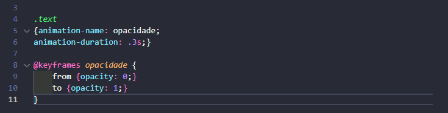
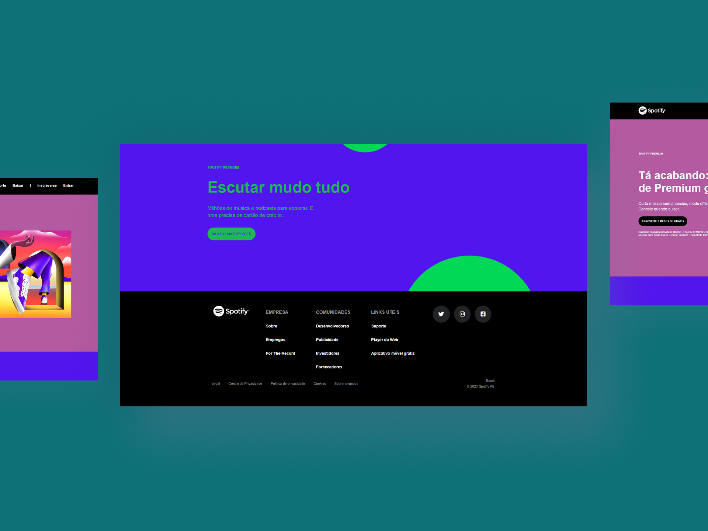

# Teste para vaga de Estagiário Desenvolvedor Web.
- Nesse repositório mostrarei que possuo experiência e capacidade de resolução sobre problemas ou dúvidas que são exibidas no dia-a-dia de um estagiário em desenvolvimento web. O mesmo é apenas meu retorno referente ao teste de emprego disponível para alunos, dentro da plataforma da B7WEB e sua ideia é recriar a página de captura do Spotify.
- Além da criação do projeto solicitado, desenvolvi o footer da página que não constava no mesmo, juntamente com efeitos hover e responsividade que não eram obrigatórios, mas um plus. 

- Tecnologias usadas nesse projeto.
    

        
        
        
        
    

### Resoluções das questões teóricas.
1. Qual a função do "head" no HTML? 
`Resposta:` O head é o cabeçalho do site e nele contem toda a informação de uma página, bem como seu titulo, folhas de estilos, meta-tags e scripts quando necessário (entre outras funcionalidades). 
#
2. Quando uma página é criada, ela automaticamente se adapta a todos os tipos de tela? Por que? 
`Resposta:` Não. Pois é preciso fazer a responsividade manualmente para outros tamanhos de telas. 
`Resposta corrigida:` Sim, uma página por padrão é responsiva. Mas é necessário fazer a responsividade manualmente para outros tamanhos de telas.
#
3. O código HTML e CSS é renderizado no servidor e repassado para o navegador em forma de imagem? 
`Resposta:` Não é repassado em forma de imagem, mas sim renderizado, levando as informações dos códigos ao navegador que em seguida exibe os mesmo formatados na tela do computador.
#
4. Qual a função das tags H (h1, h2, h3, etc) no HTML? 
`Resposta:` São tags de títulos para alguma seção do site em tamanhos diferentes. 
`Resposta corrigida:` São tags de títulos que são usados no site como um todo ou em algum contexto especifico. Também tem uma grande importância no SEO.
#
5. O que é SEO e como funciona? 
`Resposta:` É um conjunto de técnicas para a otimização de páginas na internet e seu objetivo é alcançar as primeiras posições em alguma busca. Funciona através de rankeamento. 
#
6. O uso de media query é obrigatório em todas as páginas? 
`Resposta:` Se o site possuir mais de uma versão de telas, é obrigatório sim. 
`Resposta corrigida:` É possível tornar um site responsivo somente com `clamp`, `min`, `max`, `minmax` e `css grid`. Mas será preciso usar media query caso o projeto exigir.
#
7. Qual a diferença entre CSS Inline e CSS em um arquivo? 
`Resposta:` Sua diferença é apenas o local onde se está inserindo o CSS. Um está sendo aplicado na linha de algum elemento no arquivo .html, outro tem arquivo próprio para seu uso. 
`Resposta corrigida:` Sua diferença é apenas o local onde se está inserindo o CSS. Um está sendo aplicado no atributo style de uma tag no HTML, o outro tem arquivo próprio para seu uso e é adicionado no HTML por meio da tag link.
#
8. Como criar animações no CSS? Dê um exemplo. 
`Resposta:` É possível criar animações com frames. 
`Resposta corrigida:` É possível criar animações com keyframes.

#
9. Qual a diferença entre class e ID no CSS? 
`Resposta:` ID é somente um, não é possível ter mais de um ID com o mesmo nome, classes sim.
#
10. Quais os diferentes tipos de seletores CSS? 
`Respota:` Há seletores de elementos, classes, id, pseudo-classes e pseudo-elementos e combinadores. 
`Resposta corrigida:` Há seletores de elementos, de atributos, de classes, de id, de pseudo-classes/pseudo-elementos, universal e combinadores.
#
### Imagens do projeto finalizado.

